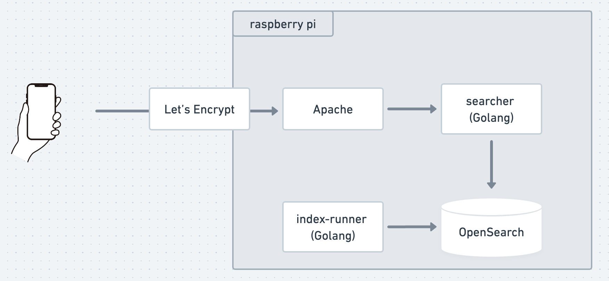

# searcher

検索アプリのAPIです。

## 構成図



## templateの登録および更新

```
POST _scripts/{テンプレート名}
{
  "script": {
    "lang": "mustache",
    "source": """
    {template.mustache}
    """,
    "params": {}
  }
}
```
